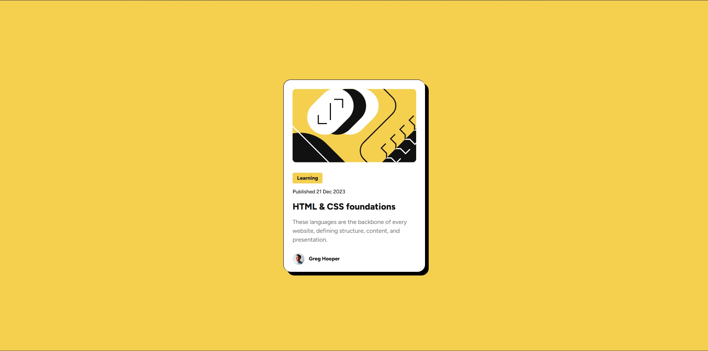
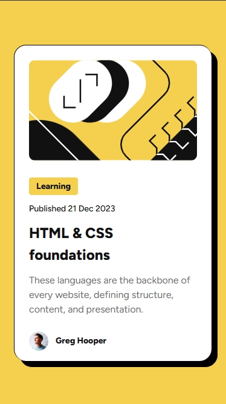

# 📰 Frontend Mentor - Blog Preview Card Solution

This is my solution to the [Blog Preview Card challenge](https://www.frontendmentor.io/challenges/blog-preview-card-ckPaj01IcS) from Frontend Mentor.

---

## 📸 Screenshot

### Desktop Version



### Mobile Version



## 🔗 Links

- **Solution URL:** [View on Frontend Mentor](https://www.frontendmentor.io/solutions/your-solution-link)
- **Live Site URL:** [View Live Demo](https://your-live-site-link.com)

---

## 🛠 Built With


- HTML5 semantic markup
- CSS custom properties
- Flexbox
- Responsive design with media queries
- Custom fonts using `@font-face`

---

## 📚 What I Learned

While working on this challenge, I practiced:

- Loading local fonts with `@font-face`
- Creating responsive card components
- Using `object-fit` for image scaling
- Applying hover effects for better interactivity

```css
.container .card-title:hover {
  cursor: pointer;
  color: hsl(47, 88%, 63%);
}
```

---

## 📌 Continued Development

I want to keep improving by:

- Making designs more fluid instead of fixed heights
- Experimenting with CSS Grid for card layouts
- Enhancing accessibility with ARIA labels

---

## 🙌 Acknowledgments

Thanks to Frontend Mentor for providing real-world challenges to practice web development skills.
